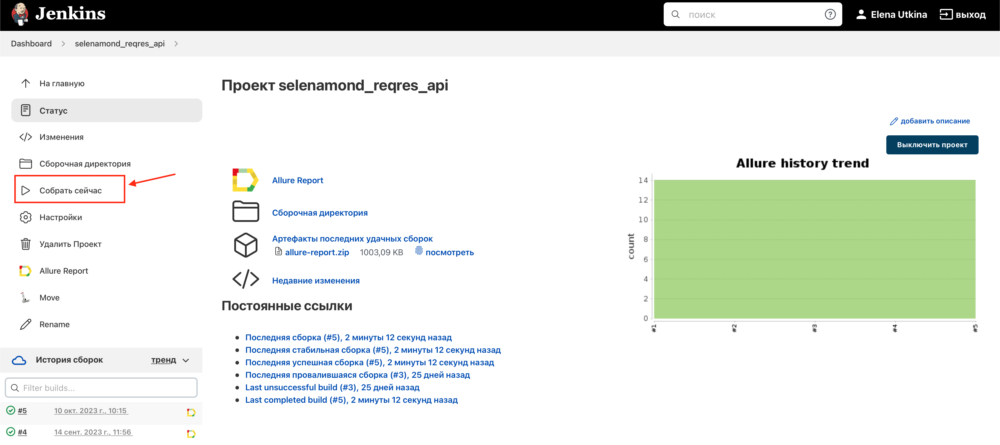
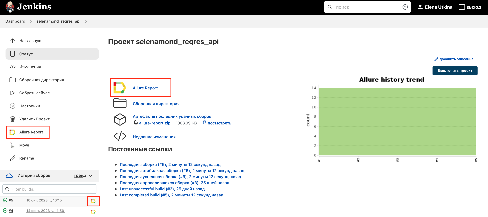
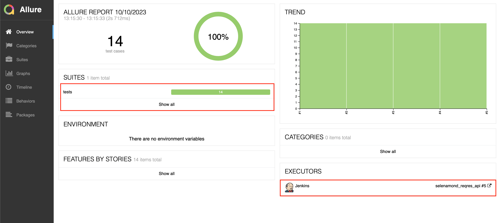
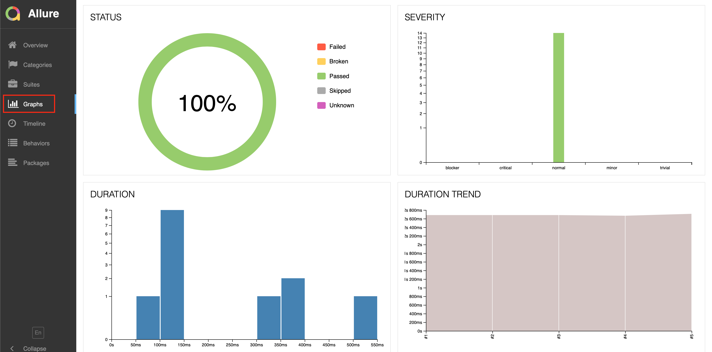
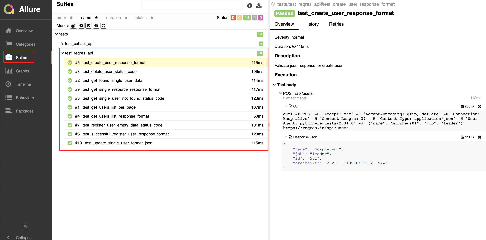
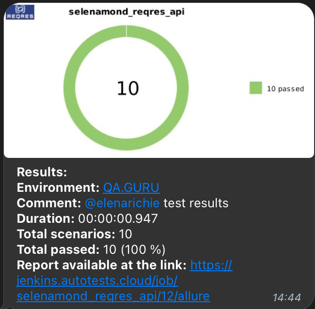

## Проект API автотестов для reqres.in


<!-- Технологии -->

### Используемые технологии
<p  align="center">
  <code></code>
  <code></code>
  <code></code>
  <code></code>
  <code></code>
  <code></code>
  <code></code>
</p>

<!-- Тест кейсы -->

### Что проверяем

* Создание пользователя: валидация формата ответа
* Удаление пользователя
* Получение данных одного пользователя
* Получение ресурса: валидация формата ответа
* Просмотр несуществущего пользователя
* Просмотр списка пользователей на конкретной странице
* Получение списка пользователей: валидация формата ответа 
* Успешная регистрация пользователя
* Регистрация пользователя с пустыми данными
* Изменение данных пользователя

## Запуск тестов
### Для локального запуска
1. Склонируйте репозиторий
2. Откройте проект в PyCharm
3. Введите в терминале команду
``` 
python -m venv .venv
source .venv/bin/activate
pip install poetry
poetry install --no-root
pytest .
```

<!-- Jenkins -->

###  Запуск проекта в Jenkins
### [Job](https://jenkins.autotests.cloud/job/selenamond_reqres_api/)
##### При нажатии на "Собрать сейчас" начнется сборка тестов и их прохождение

##### При нажатии на иконку Allure Report откроется отчет о прохождении тестов



<!-- Allure report -->

###  Allure report
##### После прохождения тестов, результаты можно посмотреть в Allure отчете, где так же содержится ссылка на Jenkins


##### Во вкладке Graphs можно посмотреть графики о прохождении тестов, по их приоритезации, по времени прохождения и др.


##### Во вкладке Suites находятся собранные тест кейсы со статусом выполнения, описанием теста, curl запроса и ответ в формате json


#### Если тест запускался локально:
Необходимо ввести в терминале команду: 
```
allure serve allure-results
``` 


<!-- Telegram -->

###  Интеграция с Telegram
##### После прохождения тестов, в Telegram bot приходит сообщение с графиком и информацией о выполненных тестах

